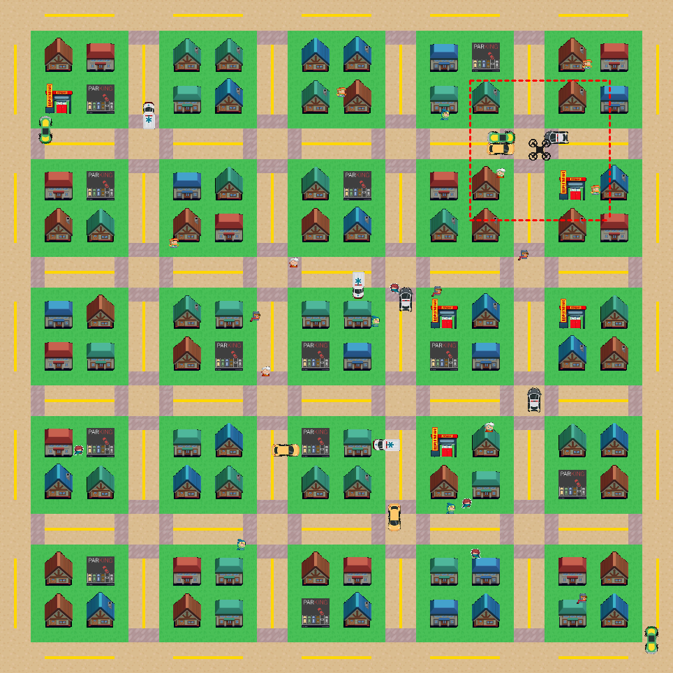

# LogiCity

Main Developer: Bowen Li, bowenli2@cs.cmu.edu



## Intro

Imagine how you learn to drive a car or play board games, you are usually informed of the rules first. Then you polish and refine your skills for better decisions from experiences. In daily life, people rely on **both explicit reasoning on symbolic rules and implicit learning from experiences** for decision-making. To make models more intelligent and safer, developing a hybrid system that combines learning with reasoning is required. LogiCity environment aims to provide a fully controllable while challenging test bed for such systems, where both reasoning and learning are required.

To be more specific, LogiCity is a simulated 2D urban environment, where all the agents navigate themselves to their goals according to some logical rules, e.g., pedestrians start from one house to one office, cars need to stop if it is close to an agent, ambulances never stops. In other words, the agents need to do both spatial reasoning (planning the least-cost global trajectory) and logical reasoning (how should they behave according to their near environments to avoid obeying rules). We hope such an environment has the following features: **(1) Fully controllabl**e: we can define any rules easily in first-order logic to control the deterministic behaviors of the agents. **(2) Concept-driven**: we will define some interesting concepts for the agents, which will matter in their rule-based decision-making. **(3) Modular**: The agents can incorporate different global planners or logical planners for their behavior. The rules are written outside the environments as a module so they can be easily modified and changed without rewriting the whole system. **(4) Noise incorporation**: the rules may not be 100% hold, we can create a controllable probability distribution for the rules and agents' actions.

In the end, we hope LogiCity can be used for evaluating cross-community downstream tasks that require both reasoning and learning, including reasoning-based navigation (Robotics), reasoning-based perception (CV), and symbolic grounding (ML).

#### Notification:

This research project and code repo are **ongoing**, please **DO NOT** share with anyone without permission from Bowen.

## Dependencies
- From scratch
  ```shell
  conda create -n logicity python=3.9
  conda activate logicity
  pip install -r requirements.txt
  ```
- Using docker
  ```shell
  docker pull bowenli1024/logicity:v1
  docker run bowenli1024/logicity:v1
  # you may need to re-build the lnn lib
  pip install -r requirements.txt
  ```

## Running

```shell
python3 main.py
```

Some important arguments:

`--vis`: if True, the simulation will save the plain color map and display the agents at each time step, by default, the images will be saved in `./vis`

`--debug`: if True, the start and goal point of each agent will be pre-defined in `./utils/sample.py`, function `sample_determine_start_goal()`

## Visualization

- Plain color

  The plain color images can be saved by setting `args.vis=True`, then you may use this tool to get a .gif file:

  ```python3
  python3 tools/img2video.py
  ```
- Render some carton-style city / UAV field of view

  (On going..., may need some coding on `pkl2city.py` and `pkl2city_uav.py`)

## Branches

Let Bowen know if you opened a new branch.

- master
  is the main and protected branch, please make sure you pull a request before modifying anything on this branch.
- concept
  is the dev branch for Bowen.
- marl
  is the dev branch for Haohong.
